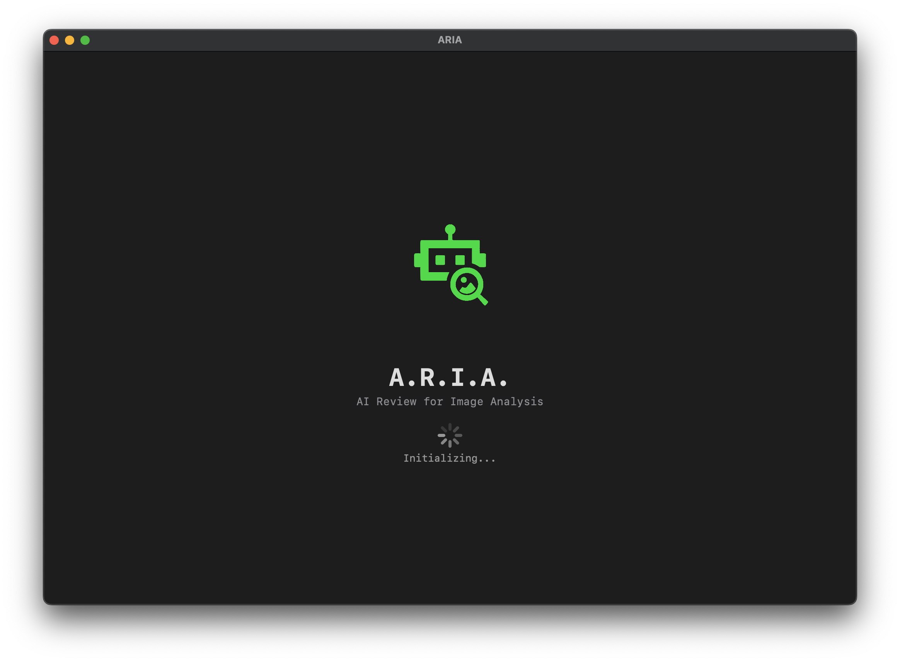
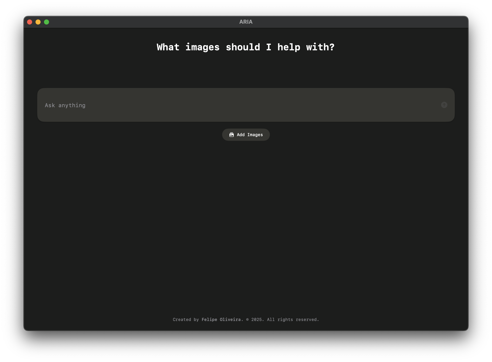

# A.R.I.A - AI Review for Image Analysis



## Project Overview

ARIA (AI Review for Image Analysis) is a macOS application designed to provide intelligent analysis and insights for images. The application allows users to upload up to 4 images, ask questions or provide prompts about the images, and receive AI-generated responses that analyze the visual content.

## Screenshots


*The main interface allows users to add images and type their prompts*


*ARIA can analyze up to 4 images simultaneously*

## Features

- **Multiple Image Support**: Upload and analyze up to 4 images simultaneously
- **Interactive UI**: Clean, minimalist interface with intuitive controls
- **Custom Prompting**: Ask specific questions about uploaded images
- **Real-time Feedback**: Visual typing indicators while responses are being generated
- **Response Variety**: Different, non-repetitive responses for each image analysis
- **Error Handling**: Graceful error management with user feedback

## Technical Implementation

### Architecture

The project follows the MVVM (Model-View-ViewModel) architecture pattern for clean separation of concerns:

- **Models**: Define data structures like `ImageResponse`
- **Views**: SwiftUI components like `HomeView`, `ResponseCard`, and `TypingIndicator`
- **ViewModels**: `HomeViewModel` manages business logic and state

### Key Components

- **ChatBotService**: Protocol-based service layer prepared for integration with AI models
- **GrowingTextField**: Custom input field that expands as content grows
- **ShakeEffect**: Interactive animation for error feedback
- **ResponseCard**: Displays image analysis results with typing animation
- **TagButton**: Reusable button component with customizable appearance

### Design Choices

1. **Minimalist UI**: The interface is intentionally clean and focused to keep user attention on the content
2. **Async/Await for AI Calls**: Modern Swift concurrency is used to handle asynchronous operations
3. **Protocol-based Service Layer**: Enables easy swapping between mock and real AI implementations
4. **Batch Processing**: Optimized to process multiple images in a single request
5. **Visual Feedback**: Typing indicators and animations provide clear system status to users

## AI Integration

The application is designed with a service-based architecture that facilitates easy integration with language models:

```swift
protocol ChatBotServiceProtocol {
    func getResponseForImage(image: NSImage, prompt: String) async -> String
    func processImages(images: [NSImage], prompt: String) async -> [String]
}
```

The current implementation uses a `MockChatBotService` that simulates AI responses with:
- 2-second processing delay to mimic real-world latency
- Unique, non-repeating responses for each image
- Thread-safe implementation for concurrent requests

This approach allows for seamless replacement with real API calls to services like OpenAI, without changing the application's core functionality.

## Future Improvements

With additional time, the following enhancements would be implemented:

1. **Real AI Integration**: Replace the mock service with actual calls to OpenAI or other AI services
2. **Response Memory**: Store past analyses to build context for future interactions
3. **Image Preprocessing**: Optimize images before sending to AI services
4. **Advanced UI Features**:
   - Zoom capabilities for images
   - Save/export functionality for analyses
   - Drag and drop support for images
5. **Multi-platform Support**: Extend to iOS and iPadOS
6. **Authentication**: Add user accounts for personalized experiences
7. **Offline Mode**: Cache previous results for offline viewing

## Installation

1. Clone the repository
2. Open the `.xcodeproj` file in Xcode 16.0 or later
3. Build and run the application on macOS 15.0 or later

## Development Process

This application was developed as part of a time-limited exercise. Key considerations included:

- **Time Management**: Prioritized functional core features over extras
- **AI Readiness**: Prepared for AI integration without implementing actual API calls
- **User Experience**: Focused on creating an intuitive and responsive interface
- **Code Quality**: Maintained SOLID principles and clean architecture despite time constraints

## Acknowledgments

- Created using SwiftUI for macOS
- Design inspiration from modern AI assistant interfaces
- AI response examples crafted to showcase potential capabilities
- Development assisted by Claude and ChatGPT for brainstorming and code suggestions

---

© 2025 Felipe Oliveira. All rights reserved.